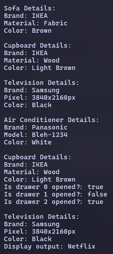

|  | Object Oriented Programming |
|--|--|
| NIM |  244107020215|
| Nama |  Herconary Angga |
| Kelas | TI - 2I |
| Repository | [link] (https://github.com/ukakooo/3rdSemester-ObjectOrientedProgramming) |

# Experiment Activity

## Bicycle inheritance
The source code can be found in the `src` folder, and below is the screenshot of the output result

**Questions:**
1. Explain the difference between object and class!

    Class is the blueprint or a template of the object. While the object is the real thing that will be used in the main method.

2. State your reason why color and engine type can be classified as attribute for car object!

    Because both are parts of the car object. 

3. State one of OOP better point than procedural programming!

    OOP is more flexible and modular, it can be described that each part of program won’t be disturbed if a feature is updated.

4. Is it allowed to define two attributes in one line code such “public String nama,alamat;”?

    Yes, it is. In fact, I implemented that method in the codes for this folder.

5. In SepedaGunung class, state your reason why merk, kecepatan, and gear attributes are not written again in this class!

    Because they already existed in the `Sepeda` class. And `SepedaGunung` is just an extension for the `Sepeda` class so there's no need to type them out again.

# Assignments

## Tasks

1. Follow these instructions to make your practical assignment is performed systematically:  
    a. Take 4 photographs of objects around you, 2 objects must be implementation of inheritance
    concept, example: refrigerator, chair, living room table, desk! As we know that living room table and desk are inherited by table class.
    b. Observe those objects to define the attribute and method!  
    c. Convert those objects into four classes in Java programming!  
    d. Add one additional class as a class which inherits its attribute and method to living room table class and desk class!  
    e. Add two attributes for each class!  
    f. Add three methods for each class including a method for showing the information!  
    g. Add one class named Demo for main class!  
    h. Instance an object for each class!  
    i. Apply each method for each object in main class!  
    j. The example which is mentioned in point 1.a should not be included in your task!  

## Answers

**Photographs**: 

**Identifying objects, attributes and its inheritance:**
- Cupboard  
    Attributes: Brand, Material, Color  
    Inherits to: Drawer
- Television  
    Attributes: Brand, Pixels, Color  
    Inherits to: Android TV
- Air Conditioner  
    Attributes: Brand, Model, Color
- Sofa  
    Attributes: Brand, Material, Color

**Program:**

The source code of the program will be in the `src/Assignment` folder, and below is the screenshot of the output.

